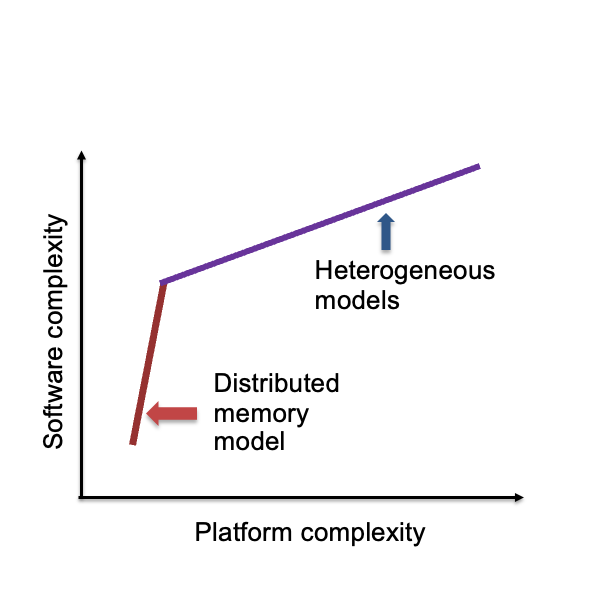
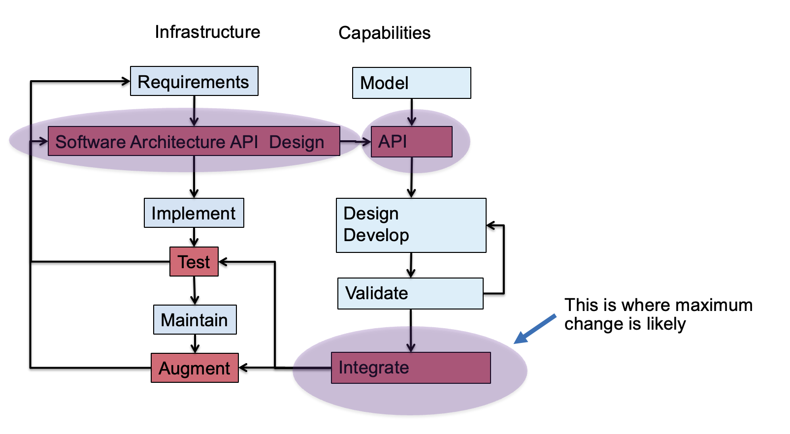
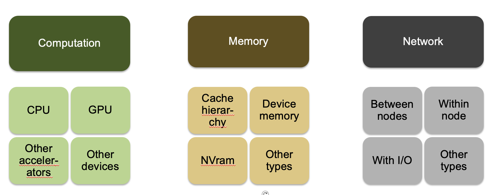

:::::::::::::::::::::::::::::::::::::: questions 

- What new challenges are posed heterogeneous computers

::::::::::::::::::::::::::::::::::::::::::::::::

::::::::::::::::::::::::::::::::::::: objectives

- To understand the challenges to design posed by heterogeneity in computers

::::::::::::::::::::::::::::::::::::::::::::::::

# New Paradigm Because of Platform Heterogeneity
Addition of hardware accelerators has added another dimension to
design considerations. Now the positive feedback loop cycle described
before also includes growing complexity due to different type of
devices in play. The figure below shows the axes of growing complexity
for software design.

{alt=""}

Question \- do the design principles change?

The answer is – not really

The details get more involved

# Go Back to the Design Model for Separation of Concerns

{alt=""}

Places where more thought has to be given is in the hierarchy of
decomposition and the interplay between finer-grain components.
The figure belows shows aspects of hardware and their impact on design
choices. 

# Platform Heterogeneity

{alt=""}

And memory access models: unified memory / gpu\-direct / explicit transfer

::::::::::::::::::::::::::::::::::::: keypoints 

- More computations rely on accelerators, software design should be cognizant of added constraints

::::::::::::::::::::::::::::::::::::::::::::::::